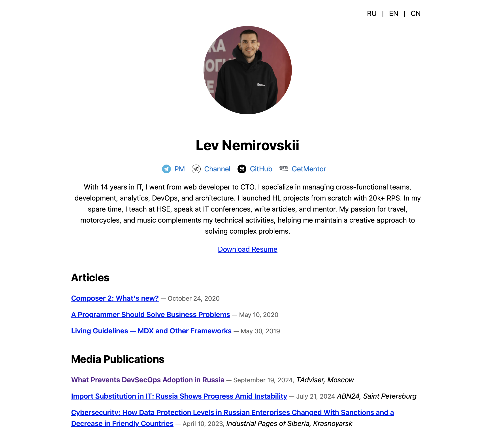

# Hugo CV Site

This repository contains the source code for my personal website, built using the Hugo CV Theme. It serves as both an example site for the theme and my personal CV site.



## Live Demo

You can see the live demo of the site at [levn.me](https://levn.me/).

## Quick Start

To get started with this site:

1. **Clone the repository:**
    ```bash
    git clone https://github.com/nemirlev/hugo-cv-site.git
    cd hugo-cv-site
    ```

2. **Run the Hugo server:**
    ```bash
    hugo server
    ```

3. **View the site:**
    Open your browser and go to `http://localhost:1313/` to see the site in action.

## Configuration

The site configuration is managed in the `hugo.yml` file. You can customize the base URL, language settings, and other parameters to fit your needs.

## Content Types

The site supports multiple content types, including articles, events, and publications. Use the following commands to create new content:

- **Articles:**
    ```bash
    hugo new article/my-new-article.md
    ```

- **Events:**
    ```bash
    hugo new events/my-new-event.md
    ```

- **Publications:**
    ```bash
    hugo new publications/my-new-publication.md
    ```

## License

This project is licensed under the MIT License. See the `LICENSE` file for more details.